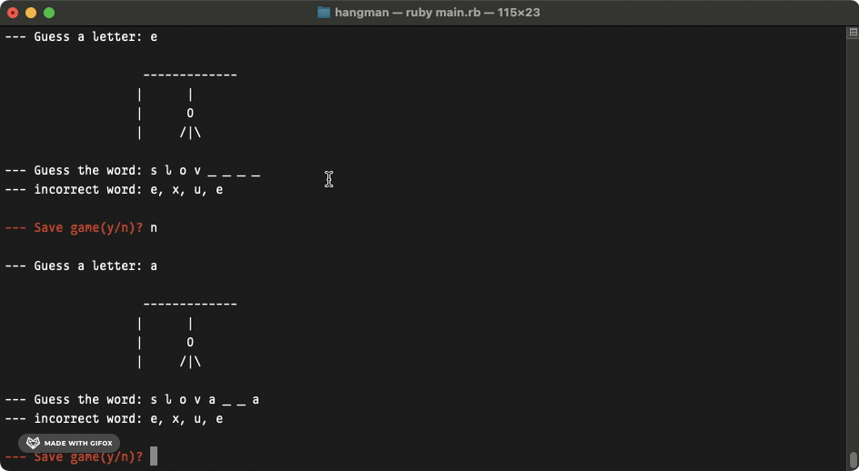
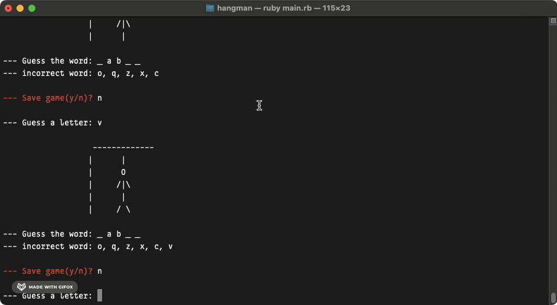

  <h1>Hangman</h1>

  

  A Command Line Version of Hangman

## About
`hangman` is a command line version of the eponymous paper and pencil game where the player guesses the secret word before the stick figure is hung (or the total number of incorrect guesses are exhausted). Gameplay continues until the player has guessed the word correctly or until they run out of guesses (i.e., when stick figure is hung).[^1]

[^1]: [This project](https://www.theodinproject.com/lessons/ruby-hangman) is from the [Ruby Course](https://www.theodinproject.com/paths/full-stack-ruby-on-rails/courses/ruby) in [The Odin Project](https://www.theodinproject.com/about).

## Showcase

  
  

  
This is a screen cast of a Human player win in the Hangman game.

  
  

  
This is a screen cast of a Human player loss in the Hangman game.

  
  

  
This is a screen cast of a save and load in the Hangman game.

  
  

  
This is a screen cast of error handling in the Hangman game.

## Technologies
- ***Git***
- ***CLI***
- ***Ruby***
- ***Replit***
- ***GitHub***

## Setup & Usage

### Setup
- The Ruby version for this project 3.3.5.
- `bundle install` installs the gems locally.
- `bundle exec ruby [filename]` runs the file.

### Usage
- For local use, users can either [fork](https://docs.github.com/en/pull-requests/collaborating-with-pull-requests/working-with-forks/fork-a-repo) and/or [clone](https://docs.github.com/en/repositories/creating-and-managing-repositories/cloning-a-repository) the repo, or
  - `bundle install` and `bundle exec ruby main.rb` to play the game.
- For remote use, users can try to directly run the game on [replit](https://replit.com/).
  - click on `Run on Replit` and then click on `Confirm and close` to play the game.

## Self Reflections
- > This project was much harder than the some of [my previous projects](https://github.com/ohgrmait?tab=repositories). The saving game at each turn and loading up the game at the start of the program was a hair pulling experience. Going back to the articles on serialization and deserialization helped a lot - so did [TOP's discord server](https://discord.gg/fbFCkYabZB) and [stackoverflow](https://stackoverflow.com/). Unfortunately, I also got sick at this moment, nonetheless, I managed to pull through and finish it. I loved the whole experience and it was an enticing project.

## Acknowledgements
- Credit for README goes to [ritaly's README cheatsheet](https://github.com/ritaly/README-cheatsheet) and [ArjunSaili1's comment](https://github.com/TheOdinProject/curriculum/discussions/25472#discussioncomment-5889343).

## Contact and Support
- Please do not hesitate to contact me at ***ohgrmait_02945*** on discord for any project queries.
- This project will no longer be worked upon and no further support will be provided for this project.